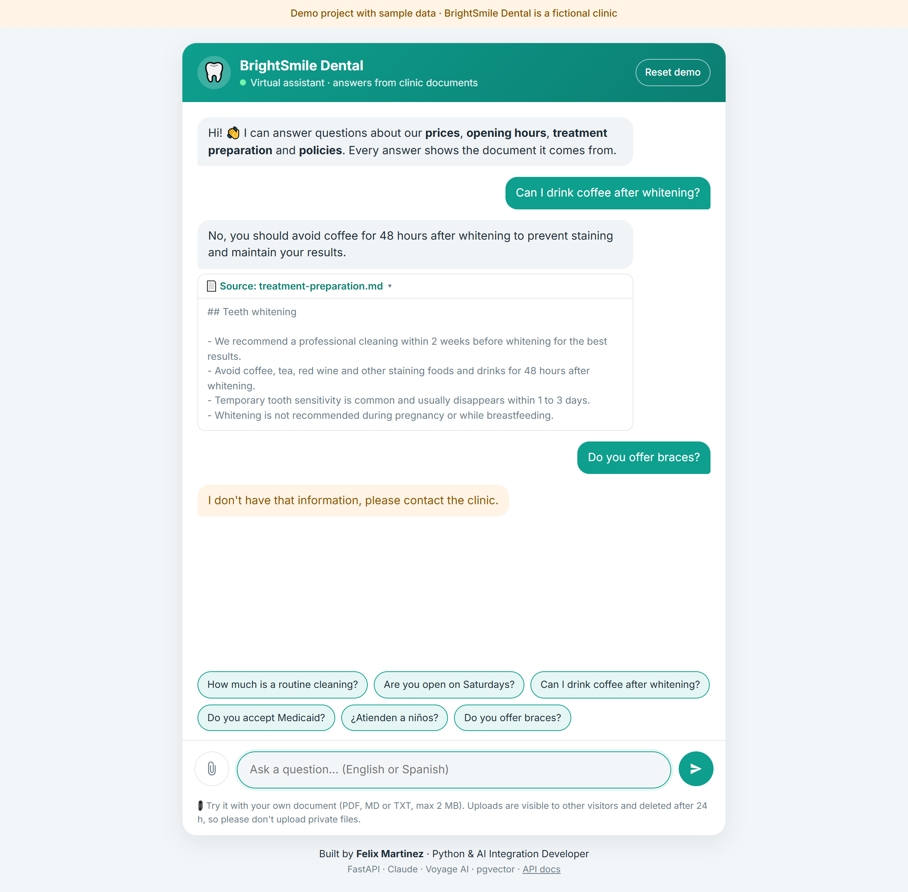
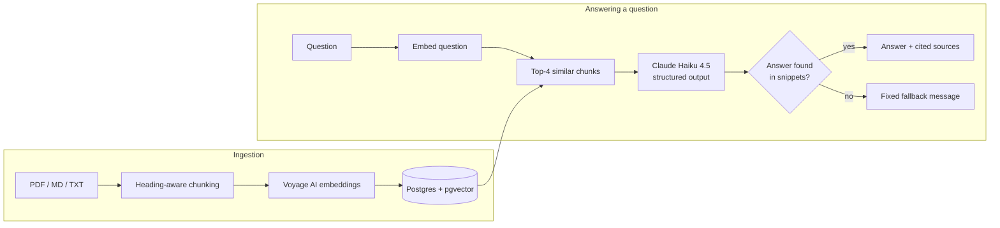

# AI Document Assistant

**A chatbot that answers customer questions from a company's own documents, cites the exact source for every answer, and says "I don't know" instead of making things up.**

[](https://github.com/felixmartinezastorquiza-dot/ai-document-assistant/actions/workflows/ci.yml)

**Live demo:** [ai-document-assistant-xwur.onrender.com](https://ai-document-assistant-xwur.onrender.com) · [API docs](https://ai-document-assistant-xwur.onrender.com/docs) · Evaluation: **13/13 passing**

> Hosted on a free tier: the first visit after a period of inactivity can take up to a minute while the server wakes up.



---

## The problem

Clinics, agencies and support teams answer the same questions every day: prices, opening hours, how to prepare for an appointment, cancellation rules. The answers already exist in their documents, but staff still have to find and retype them. Generic AI chatbots don't know the company's information, and worse, they confidently invent prices and policies.

## The solution

A retrieval-augmented generation (RAG) assistant for **BrightSmile Dental**, a fictional clinic. It searches the clinic's documents (PDF, Markdown, TXT), gives the most relevant passages to an LLM, and only lets it answer from those passages.

- **Every answer cites its source.** The document name and the exact excerpt are shown under the answer.
- **No invented answers.** If the documents don't cover a question, the assistant replies *"I don't have that information, please contact the clinic."*
- **Bring your own document.** Visitors can upload a PDF and ask questions about it right away.
- **English and Spanish.** The assistant answers in the language of the question.



## Tech stack

| Layer | Choice |
|---|---|
| API | Python 3.12, FastAPI, Pydantic |
| LLM | Anthropic Claude Haiku 4.5 (swappable to OpenAI with one env var) |
| Embeddings | Voyage AI `voyage-3.5-lite` (1024 dimensions) |
| Vector search | PostgreSQL + pgvector with an HNSW cosine index (Neon free tier) |
| Frontend | Plain HTML, CSS and JavaScript served by FastAPI |
| Quality | pytest (40 tests, no API keys needed), ruff, GitHub Actions CI, end-to-end `eval.py` |
| Deployment | Docker, Render (Blueprint in `render.yaml`) |

## Key decisions

- **The model never writes citations.** Claude returns a structured object (`answer_found`, `answer`, `source_ids`) validated with Pydantic, and it can only reference numbered snippets. The app builds the citation from its own search results, and rejects answers that cite nothing or cite a snippet that doesn't exist.
- **A similarity threshold is not enough to detect unknown answers.** In retrieval tests, *"Do you offer braces?"* scored the same similarity (0.57) as real questions because it shares vocabulary with the price list. So the LLM decides whether the snippets actually contain the answer, and the refusal text is fixed in code rather than written by the model.
- **Chunks follow document structure.** Text is split on headings first, so an answer stays with its title ("Saturday" with "9:00 AM"). Chunks are small (~1,000 chars), which makes citations point at the relevant paragraph instead of half a page.
- **pgvector over a standalone vector database.** Free hosting has ephemeral disks, so a file-based store like Chroma would lose data on every restart. Postgres keeps vectors, text and metadata in one place and can be queried with SQL.
- **Cost is bounded by design.** Per-IP rate limits (10 questions/min, 5 uploads/hour), a global daily quota, a 400-token cap per answer, a 500-character cap per question, and the cheapest Claude model that passes the evaluation.

## Evaluation

`eval.py` runs 13 questions through the real pipeline (search, LLM and citation rules):

- **10 in-scope questions:** pass only if the answer contains the expected facts **and** cites the expected document.
- **3 out-of-scope questions:** pass only if the assistant declines. This includes *"Do you offer braces?"*, a dental question the documents don't cover.

```
In-scope correct with source: 10/10 (target >= 9)
Out-of-scope declined:        3/3 (target 3)
Result: PASSED
```

## Run locally

You need free accounts on [Anthropic](https://console.anthropic.com), [Voyage AI](https://dash.voyageai.com) and [Neon](https://neon.tech) (Postgres with pgvector).

```bash
python -m venv .venv
.venv\Scripts\activate               # Windows
# source .venv/bin/activate          # macOS / Linux
pip install -e ".[dev]"
cp .env.example .env                 # then fill in your keys

python scripts/check_setup.py        # verify database, embeddings and chat credentials
uvicorn app.main:app                 # sample documents are indexed on first start
```

Open http://127.0.0.1:8000 for the chat, or http://127.0.0.1:8000/docs for the interactive API docs.

```bash
pytest                               # unit and API tests (no API keys needed)
python eval.py                       # end-to-end evaluation (uses the APIs, ~US$0.04)
python scripts/check_retrieval.py    # search quality only, no LLM calls
python scripts/ingest.py             # re-index the sample documents (safe to re-run)
```

### With Docker

```bash
docker build -t ai-document-assistant .
docker run --env-file .env -p 8000:8000 ai-document-assistant
```

### Deploy to Render

Push the repository to GitHub, then in Render choose **New > Blueprint** and select it. Render reads `render.yaml`; enter `ANTHROPIC_API_KEY`, `VOYAGE_API_KEY` and `DATABASE_URL` when prompted.

## API

| Method | Path | Description |
|---|---|---|
| `POST` | `/chat` | `{"question": "..."}` → answer, `answered` flag and citations |
| `POST` | `/documents` | Upload a PDF, MD or TXT file (max 2 MB) |
| `POST` | `/reset` | Remove all visitor uploads; sample documents are kept |
| `GET` | `/health` | Liveness check |

## What I'd add for production

- **Authentication and tenancy:** per-customer knowledge bases, with uploads visible only to their owner instead of shared demo storage.
- **Shared rate limiting:** move rate-limit state to Redis so limits hold across multiple server instances.
- **Background ingestion:** index large documents in a job queue with progress updates, instead of inside the upload request.
- **Better retrieval for large corpora:** hybrid search (keyword + vector), a reranking step, and OCR for scanned PDFs.
- **Monitoring:** structured logs, latency and cost per question, and alerts on error rates. Logging unanswered questions would show the business which documents are missing.
- **Evaluation in CI:** run `eval.py` on every prompt or model change and block regressions, with a larger question set and LLM-graded answers.
- **Conversation memory** for follow-up questions, and streaming responses for faster perceived latency.

---

*Demo project built for portfolio purposes. BrightSmile Dental is a fictional company and all documents contain sample data.*

Built by **Felix Martinez** · Python & AI Integration Developer
